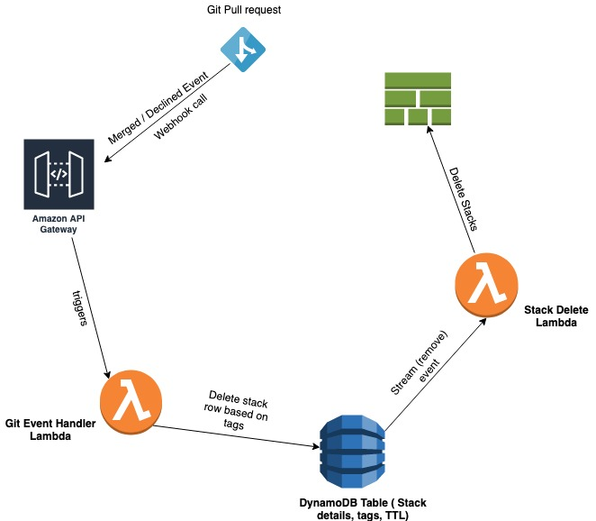

# StackJanitor

StackJanitor is an event-driven serverless application that cleans up AWS CloudFormation Stacks in development environments based on TTL (expiration time) and git pull request events. It cleans up unused development CFN stacks to help you save AWS cloud development costs.

## Use Case
We initially came up with the idea for StackJanitor when we needed to start cleaning up a lot of our ephemeral stacks on a regular basis. There are some that currently do this using polling mechanisms, but we figured we could use this as an opportunity to come up with an event-driven serverless app that can do this without having to continually poll resources

## How it works

StackJanitor automatically adds all  of the CloudFormation stacks that you create in your AWS account to a DynamoDB Table. 
If you have specified a stacktag `stackjanitor` to `enabled`, StackJanitor will add your CloudFormation Stack to DynamoDB, setting a TTL field on it to 7 days (this is default, but can be changed).

When the DynamoDB row expires and deletes the row, a lambda function is then triggered that deletes your stack.

StackJanitor can also delete stacks using either a Github or Bitbucket webhook. Our current workflow uses merged pull request events to trigger the webhook so that we can quickly delete stacks as part of our development workflow.

To use this feature, your CloudFormation Stack must also be tagged with `BRANCH` and `REPOSITORY` in order for StackJanitor to find the stack associated with your branch/repository combination and delete it.

CloudFormation stack creation event will produce a CloudTrail log which will trigger a step function/lambda to set a TTL for fresh stacks in a DynamoDB table.
CloudTrail logs from any update stack events concerning that development stack will re-invoke the Lambda function to refresh the TTL.

However, If stack resources remain unused for certain period of time, TTL expiration in the DynamoDB table will invoke the Lambda (responsible for cleaning up the stack) to perform a safe cleaning up process of the CFN stack.

## Installation

1. Clone the repo.
   `git clone https://github.com/lendi-au/StackJanitor.git`
2. Install node modules by running `npm install`
3. Install the Serverless Framework open-source CLI by running `npm install -g serverless`
4. Set AWS credentials. Serverless framework uses AWS credentials configured at `~/.aws/credentials`

   Follow [this guide](https://serverless.com/framework/docs/providers/aws/guide/credentials/) to setup AWS credentials for serverless.

5. Deploy StackJanitor by running `sls deploy`
6. Put a tag in CloudFormation stack `stackjanitor = "enabled"` to enable monitoring.

## Configuration

Set up default expiration period (TTL) in `serverless.yml` custom vars.

## Setting up the Git Webhook

Tag your CloudFormation Stack,
REPOSITORY = `Git repo name` and
BRANCH = `Git branch`.

When you deploy StackJanitor by running the `sls deploy` command, you should receive a webhook endpoint output url in your terminal.

Now, browse the webhook settings in your git repository and add the webhook enpoint.

### Bitbucket

1. Go to `Settings > Webhooks` and click `Add Webhook`.
2. Put the webhook endpoint in `URL` field.
3. Set `Status` to `Active`.
4. Set `Triggers` to `Choose from a full list of triggers` and select Pull request `Merged` and `Declined`.
5. Save the settings.

If you are using **GitHub,**

1. Go to `Settings > Webhooks` and click `Add Webhook`.
2. Put the webhook endpoint in `Payload URL` field.
3. Set Content type to `application/json`.
4. Select `Let me select individual events` and choose `Pull requests`.
5. Choose `Active` to activate the webhook trigger.
6. Save the settings.

## Upcoming features

- Scheduled lambda to send notification of potential stack clean up process.
- Slack notification
- Email notification
- Refresh TTL by clicking link (hook) from Email/Slack message.
