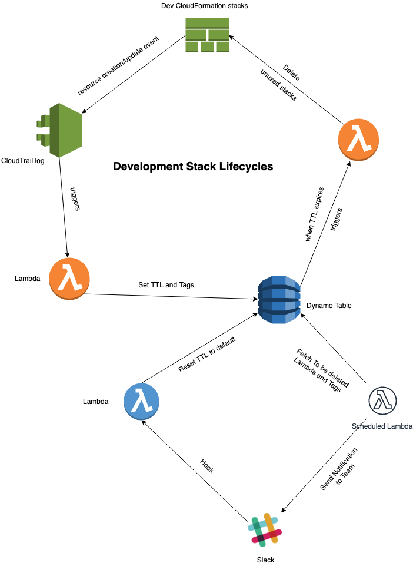

# StackJanitor

StackJanitor will monitor deployed development AWS CloudFormation Stacks and eliminate unused stacks based on the events activities to mitigate cloud costs.

## How it works

CloudFormation stack creation event will produce a CloudTrail log which will trigger a step function/lambda to set a TTL for fresh stacks in a DynamoDB table.
CloudTrail logs from any update stack events concerning that development stack will reinvoke the Lambda function to refresh the TTL.

However, If stack resources remain unused for certain period, TTL expiration in the DynamoDB table will invoke the Lambda (responsible for cleaning up the stack) to perform a safe cleaning up process of the CFN stack.

## Installation
