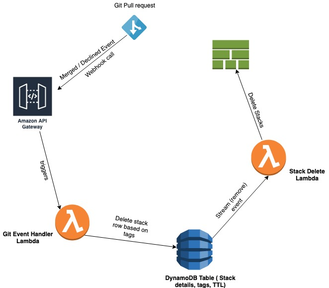

# StackJanitor

StackJanitor is an event-driven serverless application that cleans up AWS CloudFormation Stacks in development environments based on TTL (expiration time) and git pull request events. It cleans up unused development CFN stacks to help you save AWS cloud development costs.

## Use Case

We initially came up with the idea for StackJanitor when we needed to start cleaning up a lot of our ephemeral stacks on a regular basis. There are some that currently do this using polling mechanisms, but we figured we could use this as an opportunity to come up with an event-driven serverless app that can do this without having to continually poll resources.

## How it works

StackJanitor automatically adds all of the CloudFormation stacks that you create in your AWS account to a DynamoDB Table.
If you have specified a stacktag `stackjanitor` to `enabled`, StackJanitor will add your CloudFormation Stack to DynamoDB, setting a TTL field on it to 7 days (this is default, but can be changed).

When the DynamoDB row expires and deletes the row, a lambda function is then triggered that deletes your stack.

StackJanitor can also delete stacks using either a Github or Bitbucket webhook. Our current workflow uses merged pull request events to trigger the webhook so that we can quickly delete stacks as part of our development workflow.

To use this feature, your CloudFormation Stack must also be tagged with `BRANCH` and `REPOSITORY` in order for StackJanitor to find the stack associated with your branch/repository combination and delete it.

CloudFormation stack creation event will produce a CloudTrail log which will trigger a step function/lambda to set a TTL for fresh stacks in a DynamoDB table.
CloudTrail logs from any update stack events concerning that development stack will re-invoke the Lambda function to refresh the TTL.

However, If stack resources remain unused for certain period of time, TTL expiration in the DynamoDB table will invoke the Lambda (responsible for cleaning up the stack) to perform a safe cleaning up process of the CFN stack.

## Architecture

It's good to note that the actual CloudFormation delete is always done by the
`./src/handlers/deleteCloudFormationStack.ts` function AFTER the DynamoDB
stream for expired/deleted records.

As the data flow will create another cloudtrail event with the 'DeleteStack'
operation, the lambda function will be invoked a second time but nothing
will happen.

## Installation

1. Clone the repo.
   `git clone https://github.com/lendi-au/StackJanitor.git`
2. Install node modules by running `npm install`
3. Install the Serverless Framework open-source CLI by running `npm install -g serverless`
4. Set AWS credentials. Serverless framework uses AWS credentials configured at `~/.aws/credentials`

   Follow [this guide](https://serverless.com/framework/docs/providers/aws/guide/credentials/) to setup AWS credentials for serverless.

5. Deploy StackJanitor by running `serverless deploy`
6. Put a tag in CloudFormation stack `stackjanitor = "enabled"` to enable monitoring.

## Configuration

### Pre-Requisites

You will need to have CloudTrail running in your account as CloudTrail events trigger Lambda functions.

### Options

The app comes pre-configured with most things it needs. By default it sets the expiry time on a stack to 7 days.
You can override this using the `DEFAULT_EXPIRATION_PERIOD` custom variable found in the `serverless.yml`

## Webhook Support

If you don't want to wait 7 days for your stack to be deleted, you can trigger
a deletion event using a GitHub or Bitbucket webhook.

As part of your CloudFormation build, make sure you tag your CloudFormation
Stack with:
REPOSITORY = `Repository Name`
BRANCH = `Git Branch`

Your webhook endpoint will be available when you first set up your serverless
app with `serverless deploy`

### Bitbucket

1. Go to `Settings > Webhooks` and click `Add Webhook`.
2. Put the webhook endpoint in `URL` field.
3. Set `Status` to `Active`.
4. Set `Triggers` to `Choose from a full list of triggers` and select Pull request `Merged` and `Declined`.
5. Save the settings.

### GitHub

1. Go to `Settings > Webhooks` and click `Add Webhook`.
2. Put the webhook endpoint in `Payload URL` field.
3. Set Content type to `application/json`.
4. Select `Let me select individual events` and choose `Pull requests`.
5. Choose `Active` to activate the webhook trigger.
6. Save the settings.

### Additional Lambda invocation

There was a need for us to extend the gitHook functionality but this wasn't
directly related to the overall functionality of Stackjanitor.

Hence, we've extended the gitHook lambda handler to be able to invoke another
lambda function by setting the `EXTERNAL_LAMBDA` environment variable with the
ARN of the lambda function to invoke.

The default permission of the `serverless.yml` has also been updated to allow
for lambda invocations.

## Optional scheduled Lambda function for scanning and deleting old stacks

This is a fallback mechanism which can remove stacks older than
`DEFAULT_EXPIRATION_PERIOD` with the `stackjanitor: enabled` tag on the stack.

This optional scheduled Lambda function is handled by
`./src/optional-handlers/searchDeleteCloudformationStacks.ts` which can help
scan and delete old stacks when the stacks are not cleaned up properly.

This optional function is not enabled by default. You can update
`serverless.yml` to enable this function.

## Possible improvements

- Maybe we don't care to track `DeleteStack` events and perform table cleanup
  items around this as it leads to a bit of logic that goes around in circles.

## Upcoming features

- [ ] Slack Notifications when stack has been deleted
- [ ] Interactive Slack Messages to extend expiry time
